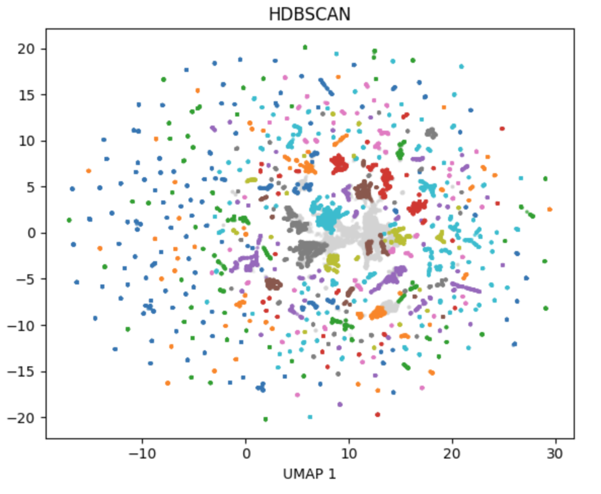

# ChainSense

> Looking into Behavioral characteristics into Ethereum wallets, revealing archetypes from on-chain transaction patterns.

[Live Demo](https://nwpp6w96vwhkizqianttgd.streamlit.app/)

## TL;DR — Key Findings
- "4 Stable Behavioral Archetypes"
- TODO
- TODO 

## What it does
We wanted to look into transaction data and cluster them into behavioral patterns that provides insight.
Additionally, we wanted to do anomoly analysis to catch indicators that led to past crashes.

## Architecture
- TODO: Add simple diagram.. Alchemy → ETL → Features → Clustering → Dashboard

## Results
- TODO: Brief overview of the 4 archetypes with one-sentence labels each
- TODO: Link to detailed writeup (the longer doc, see below)

## Tech Stack
Python, pandas, scikit-learn, hdbscan, umap, Streamlit, Alchemy.

## Getting Started
TODO: 4-5 commands max. `git clone`, `pip install -r requirements.txt`, set Alchemy key, `python pipeline.py`.

## Project Structure
TODO: A short tree showing src/, notebooks/, data/, dashboard/.

## What I'd do next
TODO: 3-5 bullets of "production considerations" — streaming ingestion, supervised classifier extension, etc.